# 🎯 Quizzo
  <h3><em>🧠 Your Ultimate Quiz Portal – Learn, Compete, and Have Fun!</em></h3>

  <!-- Solid Colored Badges -->
  <p>


  </p>

  <p>
    <a href="#-project-architecture">Architecture</a> •
    <a href="#-setup">Setup</a> •
    <a href="#️-screenshots">Screenshots</a> •
    <a href="#-features">Features</a> •
    <a href="#-license">License</a>
  </p>
</div>

---

## 🧠 Project Architecture

```mermaid
sequenceDiagram
  participant U as 👤 User
  participant B as 🌐 Browser
  participant FE as 💻 Quizzo React App
  participant BE as 🛠️ Express.js Backend
  participant C as 🧩 API Controllers
  participant DB as 🗄️ XAMPP

  U->>B: Request
  B->>FE: Load App
  FE->>BE: HTTP Request
  BE->>C: Route Handling
  C->>DB: Query/Response
```




## 🚀 Setup

### Clone the repository
```bash
git clone https://github.com/your-username/Quizzo.git
```

### Navigate to the project folder
```bash
cd Quizzo
```

### Install frontend & backend dependencies
```bash
npm install
```

### To run both frontend and backend (if applicable)
```bash
npm run dev
```

---

## 🖼️ Screenshots

<div align="center">

### 🖥️ Desktop View


### 📱 Mobile Views


</div>

---

## ✨ Features

- 🎓 Dynamic quiz questions from Open Trivia API with local fallback
- ⏱️ Timed quiz rounds with real-time scoring
- 🌙 Dark Mode support for night owls
- 🎯 Adaptive difficulty based on player performance
- 📱 Fully responsive UI – mobile, tablet, desktop friendly
- ⚡ State management using Redux Toolkit
- 🧪 Modular, scalable architecture for future enhancements

---

## 📄 License

This project is licensed under the [MIT License](LICENSE).

---

<div align="center">
  <p>Created with ❤️ by <a href="https://github.com/SuhaneeGadakh" target="_blank"><strong>Suhanee Gadakh</strong></a></p>
  <p>If <strong>Quizzo</strong> helped you, consider giving it a ⭐!</p>
</div>
